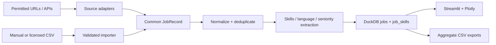

# Data model and pipeline

## Tables

### `jobs`

One row per source listing. `job_id` is an MD5 identifier derived from source, URL, title and company; it is a stable technical key, not a security feature. `content_hash` detects content changes. `is_demo` prevents synthetic evidence from being mistaken for observations.

Salary is stored as minimum and maximum TND plus period. Never mix monthly and annual numbers without explicit conversion. The dashboard currently presents monthly values and assumes imports label periods correctly.

### `job_skills`

A bridge table from listings to canonical skills. A listing has at most one row per canonical skill. The separation makes counts and co-occurrence straightforward and prevents a long comma-separated column from becoming the analytical source of truth.

### `ingestion_runs`

An operational audit: source, start/end times, status, rows seen/loaded and an error summary. Use this to measure pipeline health and freshness.

## Data flow

## Deduplication

The current natural signature is source + URL + title + company. `INSERT OR REPLACE` makes reruns idempotent. If the same vacancy appears on two sources, it remains two observations because cross-source entity resolution is uncertain. A production extension could use normalized employer/title/location plus fuzzy description similarity, while retaining a reversible mapping.

## Slowly changing listings

The compact portfolio schema keeps the latest form of a listing. For longitudinal research, add `job_snapshots(job_id, observed_at, content_hash, ...)` and an `active` flag. That distinguishes new demand from an edited or reposted advert.

## Data dictionary expectations

- `posted_date`: source publication date, ISO `YYYY-MM-DD`.
- `location`: city/governorate text after alias normalization.
- `industry`: employer or role industry, with methodology documented.
- `experience_level`: Internship, Entry-level, Mid-level, Senior or Non précisé.
- `language_requirements`: explicit mentions only; absence means not stated, not “not required.”
- `salary_*`: advertised gross/net status may be unknown and must be disclosed in analysis.

